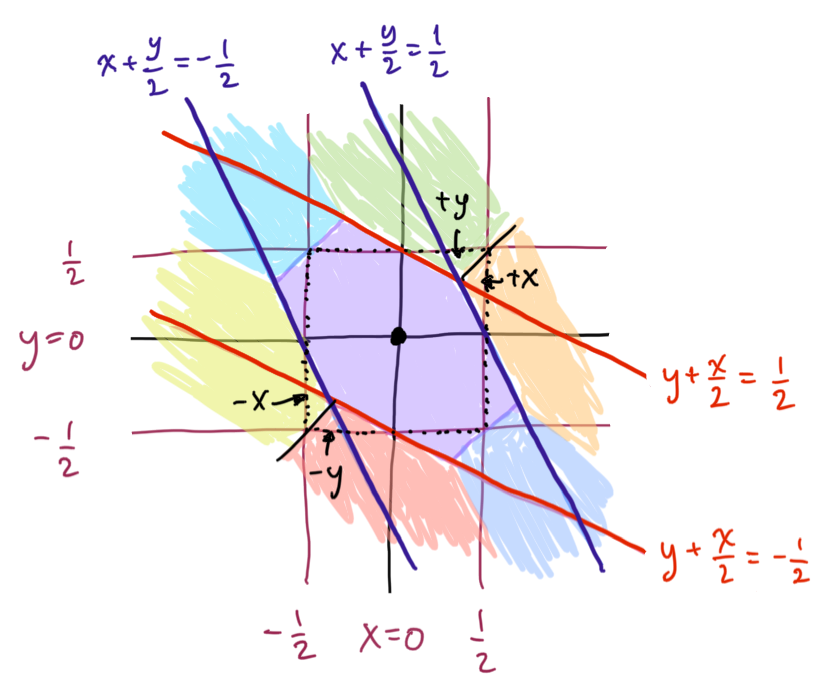

# Welcome to My GitHub Profile!

Hello there! I'm **Kazi Neyamul Hasan**, a passionate **CSE Student** and aspiring **Software Engineer**. 🚀  
I write clean, simple, and sometimes **hilarious** code (or at least I try to). Here's a peek into my **GitHub life**:

---

### **:)**

---

### 🛠️ **Technologies & Tools I Use**

- Python 🐍
- C/C++ 💻
- MySQL 🗃️
- PHP 🌐
- Java ☕
- JavaScript 🌐
- Git & GitHub 🐙

### 👨‍💻 **About Me**
I’m a **Software Engineer** in the making, focusing on problem-solving and **clean code**. When I’m not coding, I’m probably **staring at the screen**, wondering why my code doesn’t work. 😅

---

### 📝 **Feel free to check out my repos!**
Here are some of the coolest projects I’ve worked on:
- **[DropEx](https://github.com/neyamul-hasan14/DropEx-Logistics)** - A project that more easy parcel service.
- **[garbage collects ](https://github.com/neyamul-hasan14/Automatic-Garbage-Collector-with-Live-Image-Detection-using-ESP32-and-Laptop-for-webcam)** - A project that collects garbage... digitally. ♻️

---

### 💬 **Let’s Connect!**
- [LinkedIn](https://www.linkedin.com/in/kazi-neyamul-hasan-1376201bb/)
- [Portfolio](https://neyamul-hasan14.github.io/Neyamul-Hasan-Portfolio/)
- Or just hit me up right here on GitHub! 😁

---

Thanks for visiting my profile! Let's make coding fun and share some knowledge.  
Happy coding! 👨‍💻
