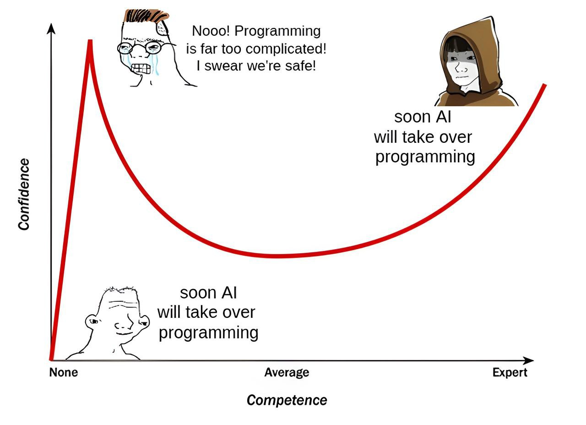

  

# Welcome to My GitHub Profile!  

Hello there! I'm **[Kazi Neyamul Hasan](https://neyamulhasan.github.io/neyamulhasan-site/)**, an enthusiast of science, new technology, programming, and online gaming. Always willing to share my knowledge and innovative ideas with others. Committed to making a positive impact in the world through software development, problem-solving, and volunteering. Ready to contribute to any team or project. I am confident that I can make a meaningful contribution to any team or project. 

---

<table align="center">
  <tr>
    <td width="300" align="center">
      
    </td>
    <td align="center">
      <h3>
        
        Programming Languages
      </h3>
      

        
        
        
        
        
      

    </td>
    <td align="center">
      <h3>
        
        Web Development
      </h3>
      

        
        
        
        
      

    </td>
  </tr>
  <tr>
    <td align="center">
      <h3>
        
        Database & Version Control
      </h3>
      

        
        
        
      

    </td>
    <td align="center">
      <h3>
        
        Machine Learning & Data Science
      </h3>
      

        
        
        
        
      

    </td>
    <td align="center">
      <h3>
        
        Core Skills
      </h3>
      

        
        
        
      

    </td>
  </tr>
</table>

---

Thanks for visiting my profile.  
Happy coding! 👍  
